# 🎯 MicroLift - Crowdfunding Platform for Social Impact

[](https://spring.io/projects/spring-boot)
[](https://reactjs.org/)
[](https://www.mysql.com/)
[](LICENSE)

> A full-stack microservices-based crowdfunding platform connecting donors with beneficiaries for Education, Medical, and Emergency campaigns.


---

## 📋 Table of Contents

- [Overview](#-overview)
- [Features](#-features)
- [Architecture](#-architecture)
- [Tech Stack](#-tech-stack)
- [Database Schema](#-database-schema)
- [Getting Started](#-getting-started)
- [API Documentation](#-api-documentation)
- [Project Structure](#-project-structure)
- [Workflows](#-workflows)
- [Docker Deployment](#-docker-deployment)
- [Contributing](#-contributing)
- [License](#-license)

---

## 🌟 Overview

**MicroLift** is a modern crowdfunding platform built with microservices architecture that enables:
- **Beneficiaries** to create verified campaigns for education, medical treatment, or emergencies
- **Donors** to discover and support campaigns with secure payments
- **Admins** to verify KYC documents and approve campaigns

### Why MicroLift?
- ✅ **Verified Campaigns**: Admin-approved campaigns ensure authenticity
- ✅ **Transparent Tracking**: Real-time fund tracking and progress updates
- ✅ **Secure Payments**: Mock payment system (production-ready for Stripe/Razorpay)
- ✅ **Email Notifications**: Automated updates for all stakeholders
- ✅ **Scalable Architecture**: Microservices for independent scaling

---

## 🚀 Features

### For Beneficiaries
- 📝 **Campaign Creation**: Create campaigns with title, description, goal amount, and supporting documents
- 📤 **Document Upload**: Upload KYC documents and campaign proofs
- 📊 **Dashboard Analytics**: Track donations, raised amounts, and campaign status
- 📧 **Notifications**: Receive emails on campaign approval and donations

### For Donors
- 🔍 **Browse Campaigns**: Filter by category (Education/Medical/Emergency), location, and status
- 👤 **See Beneficiaries**: View beneficiary names and details for transparency
- 💳 **Mock Payments**: Simulate donations (ready for real payment gateway integration)
- 📜 **Donation History**: View past donations and payment confirmations

### For Admins
- ✅ **KYC Verification**: Review and verify beneficiary documents
- 🎯 **Campaign Approval**: Approve/reject campaigns with full context
- 📋 **Integrated Review**: See campaign details AND beneficiary KYC in one modal
- 💰 **Payout Management**: Manage cash disbursements to beneficiaries

---

## 🏗️ Architecture

MicroLift follows **Microservices Architecture** with Spring Cloud for service orchestration.


### Architecture Highlights
- **API Gateway**: Single entry point, handles routing and CORS
- **Service Discovery**: Eureka server for dynamic service registration
- **Database Per Service**: Each microservice has its own MySQL database
- **Decoupled Services**: Independent deployment and scaling
- **REST APIs**: JSON-based communication between services

---

## 💻 Tech Stack

### Backend
| Technology | Purpose |
|-----------|---------|
| **Spring Boot 3.0** | Microservices framework |
| **Spring Cloud Gateway** | API routing and filtering |
| **Spring Cloud Netflix Eureka** | Service discovery |
| **Spring Data JPA** | Database ORM |
| **Spring Security + JWT** | Authentication & authorization |
| **MySQL 8.0** | Relational database |
| **Lombok** | Boilerplate code reduction |
| **EmailJS** | Email notifications |

### Frontend
| Technology | Purpose |
|-----------|---------|
| **React 18** | UI library |
| **Vite** | Build tool and dev server |
| **React Router v6** | Client-side routing |
| **Axios** | HTTP client |
| **React Bootstrap** | UI components |
| **Context API** | State management |

### DevOps & Tools
- **Docker** & **Docker Compose**: Containerization
- **PowerShell Scripts**: Service management
- **Git**: Version control

---

## 🗄️ Database Schema

Each microservice has its own dedicated database following the **Database Per Service** pattern.

### Auth Service (`microlift_auth_db`)

#### Table: `users`
| Column | Type | Constraints | Description |
|--------|------|-------------|-------------|
| `id` | BIGINT | PRIMARY KEY, AUTO_INCREMENT | Unique user identifier |
| `full_name` | VARCHAR(255) | NOT NULL | User's full name |
| `email` | VARCHAR(255) | UNIQUE, NOT NULL | User email (login) |
| `password` | VARCHAR(255) | NOT NULL | Bcrypt hashed password |
| `phone_number` | VARCHAR(20) | | Contact number |
| `role` | ENUM | NOT NULL | `DONOR`, `BENEFICIARY`, `ADMIN` |
| `kyc_status` | ENUM | DEFAULT 'PENDING' | `PENDING`, `VERIFIED`, `REJECTED` |
| `kyc_document_url` | TEXT | | Path to KYC document |
| `created_at` | TIMESTAMP | DEFAULT CURRENT_TIMESTAMP | Registration timestamp |

**Indexes:**
- `idx_email` on `email`
- `idx_role` on `role`
- `idx_kyc_status` on `kyc_status`

---

### Campaign Service (`microlift_campaign_db`)

#### Table: `campaigns`
| Column | Type | Constraints | Description |
|--------|------|-------------|-------------|
| `id` | BIGINT | PRIMARY KEY, AUTO_INCREMENT | Campaign identifier |
| `title` | VARCHAR(255) | NOT NULL | Campaign title |
| `description` | TEXT | NOT NULL | Detailed description |
| `category` | ENUM | NOT NULL | `EDUCATION`, `MEDICAL`, `EMERGENCY` |
| `goal_amount` | DECIMAL(15,2) | NOT NULL | Target amount |
| `raised_amount` | DECIMAL(15,2) | DEFAULT 0.00 | Current raised amount |
| `status` | ENUM | DEFAULT 'PENDING' | `PENDING`, `ACTIVE`, `REJECTED`, `COMPLETED` |
| `location` | VARCHAR(255) | | Beneficiary location |
| `end_date` | DATE | | Campaign end date |
| `thumbnail_url` | TEXT | | Main campaign image |
| `beneficiary_id` | BIGINT | NOT NULL | Foreign key to User |
| `created_at` | TIMESTAMP | DEFAULT CURRENT_TIMESTAMP | Creation timestamp |

#### Table: `documents`
| Column | Type | Constraints | Description |
|--------|------|-------------|-------------|
| `id` | BIGINT | PRIMARY KEY, AUTO_INCREMENT | Document identifier |
| `name` | VARCHAR(255) | | Document filename |
| `url` | TEXT | NOT NULL | File path/URL |
| `type` | VARCHAR(50) | | Document type |
| `campaign_id` | BIGINT | FOREIGN KEY | References campaigns(id) |
| `uploaded_at` | TIMESTAMP | DEFAULT CURRENT_TIMESTAMP | Upload timestamp |

**Indexes:**
- `idx_beneficiary` on `beneficiary_id`
- `idx_status` on `status`
- `idx_category` on `category`

---

### Donation Service (`microlift_donation_db`)

#### Table: `donations`
| Column | Type | Constraints | Description |
|--------|------|-------------|-------------|
| `id` | BIGINT | PRIMARY KEY, AUTO_INCREMENT | Donation identifier |
| `amount` | DECIMAL(15,2) | NOT NULL | Donated amount |
| `campaign_id` | BIGINT | NOT NULL | Target campaign |
| `donor_id` | BIGINT | NOT NULL | Donor user ID |
| `payment_id` | VARCHAR(255) | UNIQUE | Transaction/payment ID |
| `status` | VARCHAR(50) | DEFAULT 'SUCCESS' | Payment status |
| `is_anonymous` | BOOLEAN | DEFAULT FALSE | Anonymous donation flag |
| `created_at` | TIMESTAMP | DEFAULT CURRENT_TIMESTAMP | Donation timestamp |

#### Table: `payouts`
| Column | Type | Constraints | Description |
|--------|------|-------------|-------------|
| `id` | BIGINT | PRIMARY KEY, AUTO_INCREMENT | Payout identifier |
| `campaign_id` | BIGINT | NOT NULL | Campaign receiving payout |
| `amount` | DECIMAL(15,2) | NOT NULL | Payout amount |
| `status` | VARCHAR(50) | DEFAULT 'PENDING' | `PENDING`, `COMPLETED` |
| `processed_at` | TIMESTAMP | | Processing timestamp |

**Indexes:**
- `idx_campaign` on `campaign_id`
- `idx_donor` on `donor_id`
- `idx_payment_id` on `payment_id`

---

## 🛠️ Getting Started

### Prerequisites
- **Java 17+** (JDK)
- **Node.js 18+** & npm
- **MySQL 8.0**
- **Git**

### Installation

#### 1️⃣ Clone the Repository
```bash
git clone https://github.com/yourusername/microlift.git
cd microlift
```

#### 2️⃣ Setup Databases
Create MySQL databases:
```sql
CREATE DATABASE microlift_auth_db;
CREATE DATABASE microlift_campaign_db;
CREATE DATABASE microlift_donation_db;
```

Configure database credentials in each service's `application.properties`:
```properties
# backend/auth-service/src/main/resources/application.properties
spring.datasource.url=jdbc:mysql://localhost:3306/microlift_auth_db
spring.datasource.username=root
spring.datasource.password=54321
```

#### 3️⃣ Configure EmailJS (Optional)
Create a `.env` file in `frontend/`:
```env
VITE_EMAILJS_SERVICE_ID=your_service_id
VITE_EMAILJS_TEMPLATE_ID=your_template_id
VITE_EMAILJS_PUBLIC_KEY=your_public_key
```

#### 4️⃣ Start Backend Services

**Using PowerShell Scripts (Recommended for Windows)**
```powershell
# Start all microservices in separate windows
.\start_services_visible.ps1

# Stop all services
.\stop_services.ps1
```

**Manual Start (Cross-Platform)**
```bash
# 1. Start Discovery Server
cd backend/discovery-server
mvn spring-boot:run

# 2. Start API Gateway
cd backend/api-gateway
mvn spring-boot:run

# 3. Start Auth Service
cd backend/auth-service
mvn spring-boot:run

# 4. Start Campaign Service
cd backend/campaign-service
mvn spring-boot:run

# 5. Start Donation Service
cd backend/donation-service
mvn spring-boot:run

# 6. Start Media Service
cd backend/media-service
mvn spring-boot:run
```

#### 5️⃣ Start Frontend
```bash
cd frontend
npm install
npm run dev
```

#### 6️⃣ Access Application
- **Frontend**: http://localhost:5173
- **API Gateway**: http://localhost:8080
- **Eureka Dashboard**: http://localhost:8761

### Default Credentials
```
Admin Login:
Email: admin@microlift.com
Password: admin123
```

---

## 📡 API Documentation

### Base URL: `http://localhost:8080/api`

### Authentication Endpoints

#### Register User
```http
POST /auth/register
Content-Type: application/json

{
  "fullName": "John Doe",
  "email": "john@example.com",
  "password": "password123",
  "phoneNumber": "1234567890",
  "role": "BENEFICIARY"
}
```

#### Login
```http
POST /auth/login
Content-Type: application/json

{
  "email": "john@example.com",
  "password": "password123"
}

Response:
{
  "token": "eyJhbGciOiJIUzI1NiIs...",
  "user": { "id": 1, "role": "BENEFICIARY", ... }
}
```

### Campaign Endpoints

#### Get All Public Campaigns
```http
GET /campaigns/public
```

#### Get Campaign by ID
```http
GET /campaigns/{id}
```

#### Create Campaign (Requires Auth)
```http
POST /campaigns
Authorization: Bearer {token}
Content-Type: multipart/form-data

title: "Help Student Education"
description: "Campaign description..."
category: "EDUCATION"
goalAmount: 50000
location: "Mumbai"
endDate: "2024-12-31"
thumbnail: [file]
documents: [files]
```

#### Verify Campaign (Admin Only)
```http
PUT /admin/campaigns/{id}/verify?status=ACTIVE
Authorization: Bearer {admin_token}
```

### Donation Endpoints

#### Create Payment Intent
```http
POST /donations/payment-intent
Content-Type: application/json

{
  "amount": 500
}
```

#### Verify Donation
```http
POST /donations/verify
Content-Type: application/json

{
  "paymentId": "mock_txn_123456",
  "amount": 500,
  "campaignId": 1,
  "donorId": 2,
  "isAnonymous": false
}
```

---

## 📁 Project Structure

```
MicroLift/
├── backend/
│   ├── discovery-server/         # Eureka Server (:8761)
│   ├── api-gateway/              # Spring Cloud Gateway (:8080)
│   ├── auth-service/             # Authentication & Users (:8081)
│   │   └── src/main/java/com/microlift/
│   │       ├── controller/       # REST Controllers
│   │       ├── service/          # Business Logic
│   │       ├── repository/       # JPA Repositories
│   │       ├── entity/           # JPA Entities
│   │       ├── dto/              # Data Transfer Objects
│   │       └── securityconfig/   # JWT & Security
│   ├── campaign-service/         # Campaigns & Documents (:8082)
│   ├── donation-service/         # Donations & Payouts (:8083)
│   └── media-service/            # File Upload/Storage (:8084)
│
├── frontend/
│   ├── src/
│   │   ├── components/           # Reusable UI Components
│   │   │   ├── CampaignCard.jsx
│   │   │   ├── DonationModal.jsx
│   │   │   ├── Navbar.jsx
│   │   │   └── Footer.jsx
│   │   ├── pages/                # Route Components
│   │   │   ├── Home.jsx
│   │   │   ├── CampaignList.jsx
│   │   │   ├── CampaignDetail.jsx
│   │   │   ├── CreateCampaign.jsx
│   │   │   ├── AdminDashboard.jsx
│   │   │   ├── BeneficiaryDashboard.jsx
│   │   │   └── DonorDashboard.jsx
│   │   ├── context/              # React Context
│   │   │   └── AuthContext.jsx   # Global Auth State
│   │   ├── services/             # API Services
│   │   │   ├── api.js            # Axios Configuration
│   │   │   └── emailService.js   # EmailJS Integration
│   │   └── App.jsx               # Main App Component
│   ├── public/                   # Static Assets
│   └── package.json
│
├── docker-compose.yml            # Multi-container Orchestration
├── start_services_visible.ps1   # Start All Services
├── stop_services.ps1             # Stop All Services
└── README.md                     # This File
```

---

## 🔄 Workflows

### 1. User Registration & KYC Workflow


### 2. Campaign Creation & Approval Workflow


### 3. Donation Workflow

```mermaid
sequenceDiagram
    participant D as Donor
    participant F as Frontend
    participant DS as Donation Service
    participant CS as Campaign Service
    participant E as EmailJS
    participant B as Beneficiary
    
    D->>F: Select Campaign & Amount
    F->>F: Open Donation Modal
    D->>F: Click "Donate ₹500"
    F->>F: Show Processing (2s delay)
    F->>DS: POST /donations/payment-intent
    DS-->>F: Payment Intent Created
    F->>DS: POST /donations/verify
    DS->>DS: Save Donation
    DS->>CS: Update Campaign Raised Amount
    CS-->>DS: Updated
    DS-->>F: Donation Success
    F->>CS: Fetch Beneficiary Details
    CS-->>F: Beneficiary Info
    F->>E: Send Donation Email to Beneficiary
    E-->>B: "You received ₹500 from [Donor]"
    F->>F: Show Success Screen
```



### 4. Admin KYC Verification Workflow


---

## 🐳 Docker Deployment

Run the entire stack with Docker Compose:

```bash
# Build and start all services
docker-compose up --build

# Run in detached mode
docker-compose up -d

# View logs
docker-compose logs -f

# Stop all services
docker-compose down

# Stop and remove volumes (clean slate)
docker-compose down -v
```

### Docker Services
- **MySQL**: Port 3306
- **Discovery Server**: Port 8761
- **API Gateway**: Port 8080
- **Auth Service**: Port 8081
- **Campaign Service**: Port 8082
- **Donation Service**: Port 8083
- **Media Service**: Port 8084

---

## 🤝 Contributing

Contributions are welcome! Please follow these steps:

1. **Fork the repository**
2. **Create a feature branch**
   ```bash
   git checkout -b feature/amazing-feature
   ```
3. **Commit your changes**
   ```bash
   git commit -m "Add amazing feature"
   ```
4. **Push to the branch**
   ```bash
   git push origin feature/amazing-feature
   ```
5. **Open a Pull Request**

### Coding Standards
- Follow Spring Boot best practices for backend
- Use ESLint/Prettier for frontend code
- Write meaningful commit messages
- Add tests for new features

---

## 📝 License

This project is licensed under the MIT License - see the [LICENSE](LICENSE) file for details.

---

## 👨‍💻 Author

**Your Name**
- GitHub: [@yourusername](https://github.com/yourusername)
- LinkedIn: [Your LinkedIn](https://linkedin.com/in/yourprofile)
- Email: your.email@example.com

---

## 🙏 Acknowledgments

- Spring Boot Team for excellent microservices framework
- React Team for powerful UI library
- EmailJS for easy email integration
- All contributors and supporters

---

## 📸 Screenshots

### Home Page


### Campaign List


### Admin Dashboard


### Donation Modal


---

## 🔮 Future Enhancements

- [ ] Real payment gateway integration (Stripe/Razorpay)
- [ ] Real-time notifications with WebSockets
- [ ] Campaign updates and milestone tracking
- [ ] Social media sharing
- [ ] Mobile app (React Native)
- [ ] Advanced analytics dashboard
- [ ] Multi-language support
- [ ] Campaign comments and reviews

---

<div align="center">

**Made with ❤️ for Social Impact**

[⬆ Back to Top](#-microlift---crowdfunding-platform-for-social-impact)

</div>
